# HRM System - Entity Relationship Diagram

## Database Schema Overview

This document provides a comprehensive ER diagram for the HRM Corporate Management System.

```mermaid
erDiagram
    EMPLOYEE ||--o{ ATTENDANCE : "has"
    EMPLOYEE ||--o{ LEAVE-BALANCE : "has"
    EMPLOYEE ||--o{ LEAVE-APPLICATION : "applies"
    EMPLOYEE ||--o{ LEAVE-ENCASHMENT : "encashes"
    EMPLOYEE ||--o{ LOAN-REQUEST : "requests"
    EMPLOYEE ||--o{ LOAN-DISBURSEMENT : "receives"
    EMPLOYEE ||--o{ LOAN-INSTALLMENT : "pays"
    EMPLOYEE ||--o{ SALARY : "earns"
    EMPLOYEE ||--o{ PF-CONTRIBUTION : "contributes"
    EMPLOYEE ||--o{ PF-WITHDRAWAL : "withdraws"
    EMPLOYEE ||--o{ JOB-CARD : "generates"
    EMPLOYEE ||--o{ OT-RECORD : "logs"
    EMPLOYEE ||--o{ BONUS-PAYMENT : "receives"
    EMPLOYEE ||--o{ PROMOTION : "gets"
    EMPLOYEE ||--o{ INCREMENT : "receives"
    EMPLOYEE ||--o{ INTERVIEW : "conducts"
    EMPLOYEE }o--|| UNIT : "belongs-to"
    EMPLOYEE }o--|| DIVISION : "belongs-to"
    EMPLOYEE }o--|| DEPARTMENT : "belongs-to"
    EMPLOYEE }o--|| SECTION : "belongs-to"
    EMPLOYEE }o--|| SUBSECTION : "belongs-to"
    EMPLOYEE }o--|| FLOOR : "works-at"
    EMPLOYEE }o--|| LINE : "works-at"
    EMPLOYEE }o--|| DESIGNATION : "has"
    EMPLOYEE }o--|| GRADE : "has"
    EMPLOYEE ||--o{ EMPLOYEE : "reports-to"
    UNIT ||--o{ DIVISION : "contains"
    DIVISION ||--o{ DEPARTMENT : "contains"
    DEPARTMENT ||--o{ SECTION : "contains"
    SECTION ||--o{ SUBSECTION : "contains"
    SECTION ||--o{ FLOOR : "contains"
    FLOOR ||--o{ LINE : "contains"
    FLOOR ||--o{ TABLE : "contains"
    LEAVE-TYPE ||--o{ LEAVE-BALANCE : "defines"
    LEAVE-TYPE ||--o{ LEAVE-APPLICATION : "for"
    LEAVE-TYPE ||--o{ LEAVE-ENCASHMENT : "for"
    SALARY-POLICY }o--|| EMPLOYEE-CATEGORY : "for"
    DESIGNATION }o--|| EMPLOYEE-CATEGORY : "under"
    LOAN-TYPE ||--o{ LOAN-REQUEST : "offers"
    LOAN-REQUEST ||--|| LOAN-DISBURSEMENT : "leads-to"
    LOAN-REQUEST ||--o{ LOAN-INSTALLMENT : "has"
    BONUS-POLICY ||--o{ BONUS-PAYMENT : "defines"
    PF-SETTING ||--o{ PF-CONTRIBUTION : "applies"
    GRADE }o--|| SALARY-SETTING : "has"
    GRADE ||--o{ EMPLOYEE : "uses"
    EMPLOYEE-CATEGORY ||--o{ OT-ELIGIBILITY-SETTING : "has"
    EMPLOYEE-CATEGORY ||--o{ LEAVE-SETTINGS : "has"
    DESIGNATION ||--o{ OT-ELIGIBILITY-SETTING : "has"
    DESIGNATION ||--o{ LEAVE-SETTINGS : "has"
    CANDIDATE ||--o{ INTERVIEW : "participates-in"
    INTERVIEW ||--o{ EMPLOYEE : "conducted-by"
    CANDIDATE ||--o{ OFFER : "receives"
    CANDIDATE ||--o{ CANDIDATE-DOCUMENT : "has"
    JOB-REQUISITION ||--o{ CANDIDATE : "has"
```



## Entity Details

### 1. EMPLOYEE (Core Entity)

**Primary Entity** - Central to the entire system

- Connects to all other modules
- Stores comprehensive employee information
- Links to organizational structure

**Key Attributes:**

- `employee_id` - Unique identifier
- `code` - Employee code
- `first_name`, `last_name`
- `phone`, `email`
- `join_date`, `confirm_date`
- `OT_eligibility`, `software_user`
- Bank account details
- Personal information (DOB, nationality, etc.)

**Foreign Keys:**

- User (1-to-1)
- Unit, Division, Department, Section, SubSection
- Floor, Line, Designation, Grade
- Reporting_to (Self-referential for hierarchy)

---

### 2. Organizational Structure (Settings_App)

**Hierarchical Organization**

```
Company
  └── Unit (1-to-Many)
       └── Division (1-to-Many)
           └── Department (1-to-Many)
               └── Section (1-to-Many)
                   ├── SubSection (1-to-Many)
                   └── Floor (1-to-Many)
                       ├── Line (1-to-Many)
                       └── Table (1-to-Many)
```

**Key Entities:**

- `Company` - Top-level organization
- `Unit` - Major divisions within company
- `Division` - Functional areas
- `Department` - Specific departments
- `Section` - Sections within departments
- `SubSection` - Sub-sections
- `Floor` - Physical floors
- `Line` - Production/work lines
- `Table` - Work tables/stations

---

### 3. Leave Management (Leaves_App)

**Entities:**

- `LEAVE-TYPE` - Types of leaves (Casual, Sick, Earned, etc.)
- `LEAVE-BALANCE` - Employee leave balance per leave type
  - Unique on (Employee, LeaveType)
  - `total`, `used`, `remaining` (calculated)
- `LEAVE-APPLICATION` - Employee leave requests
  - Status: Pending, Approved, Rejected
  - Tracks `start_date`, `end_date`, `total_days`
- `LEAVE-ENCASHMENT` - Converting unused leaves to cash
  - `days_encashed`, `encash_date`

**Relationships:**

- Employee → Leave-Balance (1-to-Many)
- Employee → Leave-Application (1-to-Many)
- Employee → Leave-Encashment (1-to-Many)
- Leave-Type → Leave-Balance (1-to-Many)
- Leave-Type → Leave-Application (1-to-Many)

---

### 4. Attendance Management (Attendance_App)

**Entities:**

- `ATTENDANCE` - Daily attendance records
  - Status: Present, Absent, Weekend, Holiday, Leave
  - Tracks `in_time`, `out_time`, `work_hours`
  - `ot_hours` - Overtime hours
  - `is_manual` - Flag for manual entries
  - Unique on (Employee, Date)

- `ATTENDANCE-UPLOAD` - Bulk attendance imports
  - `file`, `upload_date`
  - `total_rows`, `processed`

- `JOB-CARD` - Monthly attendance summary
  - `total_present`, `total_absent`, `total_leave`
  - `total_weekend`, `total_holiday`
  - `total_ot_hours`
  - Unique on (Employee, Month, Year)

- `OT-RECORD` - Overtime records
  - `ot_hours`, `approved`
  - Tracks by date

**Relationships:**

- Employee → Attendance (1-to-Many)
- Employee → Job-Card (1-to-Many)
- Employee → OT-Record (1-to-Many)

---

### 5. Payroll Management (Payroll_App)

**Entities:**

- `SALARY-POLICY` - Salary structure definition
  - FK: EmployeeCategory
  - Stores salary components as JSON:
    - `basic`, `house_rent`, `medical`
    - `mobile_allowance`, `transport`, `conveyance`
    - `food`, `others1`, `others2`
  - Unique on (EmployeeCategory)

- `SALARY` - Monthly salary calculation
  - FK: Employee
  - Monthly/yearly identifiers
  - Earnings: `basic`, `house_rent`, `medical`, `transport`, `other_allowance`, `ot_amount`
  - Deductions: `pf_employee`, `pf_employer`, `loan_deduction`, `tax_deduction`
  - Totals: `total_earnings`, `total_deductions`, `net_salary`
  - Unique on (Employee, Month, Year)

- `INCREMENT` - Salary increments
  - Tracks `previous_salary`, `new_salary`, `increment_amount`
  - `effective_date`

- `PROMOTION` - Employee promotions
  - `previous_designation`, `new_designation`
  - `effective_date`

- `BONUS-POLICY` - Bonus rules
  - `title`, `percentage`, `active`

- `BONUS-PAYMENT` - Bonus payments
  - FK: Employee, BonusPolicy
  - Monthly/yearly tracking

**Relationships:**

- Employee → Salary (1-to-Many)
- Employee → Increment (1-to-Many)
- Employee → Promotion (1-to-Many)
- Employee → Bonus-Payment (1-to-Many)
- BonusPolicy → Bonus-Payment (1-to-Many)
- EmployeeCategory → Salary-Policy (1-to-1)

---

### 6. Loan Management (Loans_App)

**Entities:**

- `LOAN-TYPE` - Available loan types
  - `name`, `max_amount`, `interest_rate` (yearly %)

- `LOAN-REQUEST` - Employee loan applications
  - Status: Pending, Approved, Rejected
  - `requested_amount`, `installment_months`
  - `reason`, `approved_by`, `approved_at`

- `LOAN-DISBURSEMENT` - Loan disbursement tracking
  - 1-to-1 with LoanRequest
  - `disbursed_amount`, `disbursement_date`

- `LOAN-INSTALLMENT` - Monthly installment tracking
  - `month`, `year`, `amount`
  - `paid`, `paid_at`
  - Unique on (LoanRequest, Month, Year)

**Relationships:**

- Employee → Loan-Request (1-to-Many)
- Employee → Loan-Disbursement (1-to-Many)
- Employee → Loan-Installment (1-to-Many)
- Loan-Type → Loan-Request (1-to-Many)
- Loan-Request → Loan-Disbursement (1-to-1)
- Loan-Request → Loan-Installment (1-to-Many)

---

### 7. Provident Fund (PF_App)

**Entities:**

- `PF-SETTING` - Global PF configuration
  - `employee_percent`, `employer_percent`
  - `active` flag

- `PF-CONTRIBUTION` - Monthly PF contributions
  - FK: Employee
  - `employee_amount`, `employer_amount`, `total`
  - Monthly/yearly tracking
  - Unique on (Employee, Month, Year)

- `PF-WITHDRAWAL` - PF withdrawal requests
  - `amount`, `withdrawal_date`, `reason`
  - `approved`, `approved_by`

**Relationships:**

- Employee → PF-Contribution (1-to-Many)
- Employee → PF-Withdrawal (1-to-Many)

---

### 8. Recruitment (Recruitment_App)

**Entities:**

- `JOB-REQUISITION` - Job openings
  - `code`, `title`, `department`
  - `vacancies`, `description`
  - Status: Draft, Open, Closed
  - FK: User (created_by)

- `CANDIDATE` - Job applicants
  - Status: Applied, Screening, Shortlisted, Interview, Offered, Rejected, Hired
  - `email`, `phone`, `resume`
  - `current_company`, `current_ctc`, `expected_ctc`
  - FK: JobRequisition (nullable)

- `CANDIDATE-DOCUMENT` - Supporting documents
  - `name`, `file`
  - FK: Candidate

- `INTERVIEW` - Interview scheduling
  - `scheduled_at`, `mode` (Onsite/Zoom/Phone)
  - `result`, `notes`
  - Many-to-Many with Employee (panel members)
  - FK: Candidate, User (scheduled_by)

- `OFFER` - Job offers
  - `offered_ctc`, `joining_date`
  - `accepted`, `accepted_at`
  - FK: Candidate, User (issued_by)

**Relationships:**

- Job-Requisition → Candidate (1-to-Many)
- Candidate → Interview (1-to-Many)
- Candidate → Candidate-Document (1-to-Many)
- Candidate → Offer (1-to-Many)
- Interview → Employee (Many-to-Many for panel)

---

### 9. Settings (Settings_App)

**Configuration Entities:**

- `GRADE` - Employee grades/levels
- `EMPLOYEE-CATEGORY` - Employee categories
- `DESIGNATION` - Job designations
  - FK: EmployeeCategory

- `SALARY-SETTING` - Grade-wise salary structure
  - 1-to-1 with Grade

- `OT-ELIGIBILITY-SETTING` - Overtime eligibility rules
  - FK: EmployeeCategory, Designation
  - Unique on (EmployeeCategory, Designation)

- `LEAVE-SETTINGS` - Leave entitlements
  - Tracks different leave types with days
  - Carry-forward and adjustment rules
  - FK: EmployeeCategory, Designation
  - Unique on (LeaveYear, EmployeeCategory, Designation)

- `BANK` - Bank information
- `GROUP` - Employee groups/categories
- `TABLE` - Work tables/stations

**Relationships:**

- Employee-Category ← → Designation (1-to-Many)
- Employee-Category → OT-Eligibility-Setting (1-to-Many)
- Employee-Category → Leave-Settings (1-to-Many)
- Designation → OT-Eligibility-Setting (1-to-Many)
- Designation → Leave-Settings (1-to-Many)
- Grade → Salary-Setting (1-to-1)

---

## Relationship Cardinalities

| From              | To                | Cardinality | Type         |
| ----------------- | ----------------- | ----------- | ------------ |
| Employee          | Attendance        | 1:N         | Has          |
| Employee          | Leave-Balance     | 1:N         | Has          |
| Employee          | Leave-Application | 1:N         | Applies      |
| Employee          | Salary            | 1:N         | Earns        |
| Employee          | Loan-Request      | 1:N         | Requests     |
| Employee          | PF-Contribution   | 1:N         | Contributes  |
| Employee          | Designation       | N:1         | Has          |
| Employee          | Grade             | N:1         | Has          |
| Employee          | Unit              | N:1         | Belongs-to   |
| Employee          | Division          | N:1         | Belongs-to   |
| Employee          | Department        | N:1         | Belongs-to   |
| Leave-Type        | Leave-Balance     | 1:N         | Defines      |
| Leave-Type        | Leave-Application | 1:N         | Offers       |
| Leave-Application | Salary            | 1:1         | References   |
| Loan-Type         | Loan-Request      | 1:N         | Offers       |
| Loan-Request      | Loan-Disbursement | 1:1         | Leads-to     |
| Loan-Request      | Loan-Installment  | 1:N         | Has          |
| Employee-Category | Salary-Policy     | 1:1         | Defines      |
| Employee-Category | Designation       | 1:N         | Has          |
| Grade             | Salary-Setting    | 1:1         | Has          |
| Candidate         | Interview         | 1:N         | Participates |
| Interview         | Employee          | N:M         | Conducted-by |
| Job-Requisition   | Candidate         | 1:N         | Has          |

---

## Key Design Patterns

### 1. **Self-Referential Relationship**

```
Employee.reporting_to → Employee
```

Allows hierarchical employee structure with managers and reportees.

### 2. **Unique Constraints**

- `(Employee, Date)` - Attendance
- `(Employee, Month, Year)` - Salary, Job-Card, PF-Contribution, Loan-Installment
- `(Employee, LeaveType)` - Leave-Balance
- `(LeaveYear, EmployeeCategory, Designation)` - Leave-Settings

### 3. **JSON Fields (PostgreSQL/MySQL)**

- Salary-Policy stores component calculations as JSON
- Allows flexible salary structure management

### 4. **Many-to-Many Relationships**

- Interview ← → Employee (Panel members)

### 5. **Soft Deletes & Status Tracking**

- Candidates have status progression
- Leave-Applications have approval workflow
- Loan-Requests track approval process

---

## Data Flow Diagram

```
Recruitment Pipeline:
Job-Requisition → Candidate → Interview → Offer → (Hired) → Employee

Employee Lifecycle:
Employee → Designation → Designation-Settings → Leave-Settings/OT-Settings
         → Salary-Policy → Salary → Deductions
         → Attendance → Job-Card
         → Leave-Application → Leave-Balance
         → Loan-Request → Loan-Disbursement → Loan-Installment
         → PF-Contribution → PF-Withdrawal
```

---

## Database Statistics

- **Total Entities**: 35+
- **Total Tables**: 35+
- **Foreign Keys**: 50+
- **Unique Constraints**: 15+
- **Core Hub**: Employee (connects to 12+ entities)

---

## Technology Stack

- **Backend**: Django (Python)
- **Database**: SQLite (Development) / PostgreSQL (Production)
- **ORM**: Django ORM
- **API**: Django REST Framework
